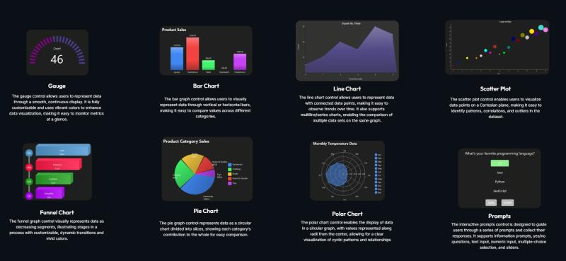

# WinUi3Charts
Win3UiCharts is a custom control library designed to enhance the development experience by providing additional controls tailored specifically for WinUI 3. This library aims to help in the creation of modern, feature-rich UIs.

To set it up in your project or testing environment, follow the steps in the [wiki](https://github.com/mitch344/WinUi3Charts/wiki/Setup-&-Testing).
